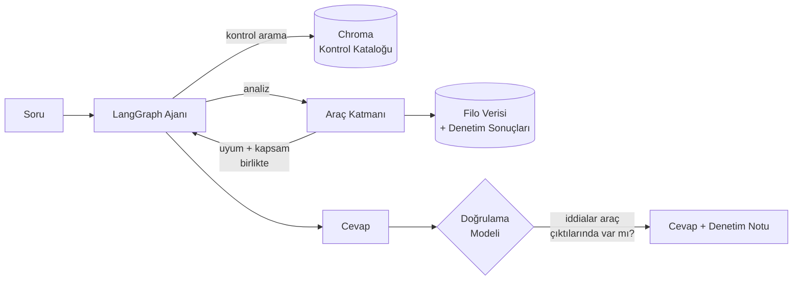

# Sertleştirme Analiz Ajanı — Sunucu Filosunda Uyum, Maruziyet ve Belirsizlik

Sunucu filosunun sertleştirme durumunu doğal dilde sorgulanabilir kılan bir
analiz ajanı. Ajan hangi analizi yapacağına çalışma anında kendisi karar verir;
her bulguyu ihlal ettiği **BDDK maddesine** bağlar.

> KKB Hackathon 2026 — Agentic Data Analytics için geliştirildi.

---

## Çözmeye çalıştığı problem

Uyumluluk panellerinin çoğu iki hata yapar. İkisi de sayıları iyi gösterir.

**Birincisi: bulgu sayısı önceliğe eşit sanılır.** İzole bir test makinesindeki
45 bulgu, listenin tepesine çıkar. İnternete açık, hassas veri tutan bir üretim
veritabanındaki 3 bulgu ise dibe düşer. Oysa acil olan ikincisidir.

**İkincisi: "kontrol edilmedi", "geçti" sayılır.** OpenSCAP/XCCDF standardı
`pass`, `fail`, `error`, `unknown`, `notchecked` durumlarını ayırır. Paneller
bunları ikiliye indirger ve `notchecked`'i yeşil boyar. Denetim ajanı bozuk olan
bir sunucu, hiç `fail` üretmediği için **en uyumlu sunucu gibi görünür.**

Bu proje ikisini de reddediyor — ve reddetme prompt'ta değil, kod yolunda.

---

## Mimari



Ajan sabit bir hat izlemez. Soruyu okur, gerekirse kontrol kataloğunda semantik
arama yapar, uygun aracı seçer, sonucu görür, gerekirse bir analiz daha yapar.
Cevabı yazdıktan sonra **ayrı bir model çağrısı** her sayısal iddiayı araç
çıktılarıyla karşılaştırır.

| Dosya | Sorumluluk |
|---|---|
| `src/controls.py` | Kontrol kataloğu ve BDDK eşlemesi. Tek gerçek kaynak. |
| `src/fleet.py` | Veri erişimi. Uyum ve kapsam oranını **birlikte** döndürür. |
| `src/scoring.py` | Maruziyet ağırlıklı risk, belirsizlik riski. |
| `src/freshness.py` | Kapsam ve tazelik; "yanıltıcı temiz" tespiti. |
| `src/catalog.py` | Chroma üzerinde semantik kontrol araması. |
| `src/tools.py` | 8 analiz aracı. |
| `src/agent.py` | LangGraph akışı + doğrulama modeli. |
| `src/api.py` | FastAPI servisi. |

---

## Kontrol kataloğu — kimlikler uydurulmadı

61 kontrol, 15 kategori, 5 BDDK maddesi.

- **19 kontrol** CIS Ubuntu Linux Benchmark bölüm 5.2'den; kimlikler ve İngilizce
  başlıklar **birebir** alındı (`5.2.12 Ensure SSH PermitRootLogin is disabled`).
- **42 kontrol** CISOfy/lynis `tests.db`'den; gerçek test kimlikleri
  (`FIRE-4590`, `ACCT-9630`, `PKGS-7392`, `AUTH-9283`).

Doğrulanmış başlığı olmayan bölümler için CIS numarası uydurmak yerine Lynis
kimliği kullanıldı. **Katalogdaki her satır dışarıdan kontrol edilebilir.**

### BDDK eşlemesi

Her kontrol, *Bankaların Bilgi Sistemleri ve Elektronik Bankacılık Hizmetleri
Hakkında Yönetmelik* (yürürlük 1 Temmuz 2020) maddesine bağlı:

| Madde | Konu | Kontrol |
|---|---|---|
| 11 | Kimlik doğrulama ve işlem güvenliği | 16 |
| 13 | İz kayıtları | 10 |
| 14 | Ağ güvenliği | 15 |
| 15 | Güvenlik yapılandırması yönetimi | 16 |
| 16 | Güvenlik açıkları ve yama yönetimi | 4 |

Böylece çıktı "142 kontrol başarısız" değil, **"MADDE 14 kapsamında 521 sapma,
119'u internete açık sunucuda"** olur. Bankacılık denetiminde konuşulan dil budur.

---

## İki tez, veri üzerinde

Aşağıdaki sayılar `python scripts/demo_posture.py` çıktısından; **hiçbiri model
tarafından üretilmedi.**

### 1. Bulgu sayısı önceliği göstermez

Aynı filo, iki farklı sıralama:

| Ham bulgu sayısına göre | Maruziyet ağırlıklı riske göre |
|---|---|
| srv-033 — 45 bulgu, **test**, iç ağ | srv-029 — 8 bulgu, DMZ, **internete açık** |
| srv-094 — 38 bulgu, **test**, iç ağ | srv-072 — 27 bulgu, DMZ, **internete açık** |
| srv-069 — 37 bulgu, **test** | srv-052 — 15 bulgu, **üretim**, DMZ |
| srv-099 — 32 bulgu, **test** | srv-084 — 14 bulgu, **üretim**, DMZ |

**İki listenin ortak sunucusu: 0/4.**

Maruziyet çarpanı çarpımsaldır: ortam × ağ bölgesi × veri sınıflandırması ×
internet erişimi × destek durumu. En maruz sunucu en korunaklıdan ~10 kat ağır sayılır.

### 2. Bilinmeyen, uyumlu değildir

`notchecked`, `error` ve `unknown` sonuçları **hiçbir yerde** uyumlu sayılmaz.
Uyum oranı yalnızca gözlemlenen sonuçlar üzerinden hesaplanır ve **her zaman
kapsam oranıyla birlikte** döner.

```
Hakkında hüküm verilebilen sunucu : 82/120
Kapsamı yetersiz                  : 16
Denetimi bayat (>30 gün)          : 25
'Temiz görünen ama bilinmeyen'    : 10
```

İkili bir panelde **yeşil** görünecek sunucular:

| Sunucu | Uyum oranı | Kapsam oranı | Gerekçe |
|---|---|---|---|
| srv-107 | **%100.0** | %18.3 | kapsam yalnızca %18 |
| srv-039 | %80.0 | %17.0 | kapsam yalnızca %17 |
| srv-009 | %82.3 | %28.3 | kapsam yalnızca %28 |
| srv-058 | %81.5 | %90.0 | 105 gündür denetlenmemiş |

srv-107 **%100 uyumlu** görünüyor. Kontrollerin %82'si hiç koşturulmamış.

Belirsizlik sıfır risk de sayılmaz. Bir kontrolün beklenen riski, o kontrolün
**filo genelinde gözlemlenen uyumsuzluk oranıyla** tahmin edilir — uydurma bir
sabitle değil — ve raporda `belirsiz_risk` olarak **ayrı kalem** gösterilir.

---

## Doğrulama katmanı

Ajan cevabını yazdıktan sonra ayrı bir model çağrısı, iddiaları araç
çıktılarıyla karşılaştırır. Bu katman dekoratif değil — gerçek çalışmada gerçek
hata yakalıyor:

```
$ python cli.py "Filoda uyumlu görünen ama aslında durumu bilinmeyen sunucu var mı?"

--- Doğrulama: SORUNLU ---
  ! srv-014 için uyum oranı (%90,91) verilmesine rağmen yanında
    kapsam oranı (%91,67) sunulmamıştır.
  ! Araç çıktılarında geçmeyen BDDK Madde 13 cevaba eklenmiştir.
```

Ajan doğru sunucuyu bulmuştu; ama kendi kuralını ihlal etmiş ve desteklenmeyen
bir düzenleyici atıf eklemişti. Doğrulama bunu kullanıcıdan gizlemiyor.

**Dürüst not:** Bu katman muhafazakâr. Bir koşumda ajanın *doğru* sayılarını
"uydurulmuş" diye işaretledi — literatürde belgelenmiş bir eğilim; LLM
denetçileri güvenlik değerlendirmesinde yanlış-pozitife belirgin biçimde
meyilli. O yüzden doğrulama tek savunma değil, en üstteki katman.

### Zorunlu düzeltme — modele değil, koda güvenen katman

Doğrulama bir model çağrısıdır: düşebilir, yanılabilir, kota nedeniyle kapalı
olabilir. Bu yüzden altında **deterministik** bir katman var.

Ajan, arkasında hiçbir başarılı araç çıktısı olmadan cevap yazmaya kalkarsa
akış onu `END`'e bırakmaz; araç hatasını somut bir yönlendirmeyle geri verip
tekrar denemeye zorlar:

```
DUR. Hiçbir araç çağrın başarılı sonuç döndürmedi, elinde hiçbir veri yok.

Alınan hatalar:
  - "Bilinmeyen kontrol: SSH-ROOT-1". Katalogda 61 kontrol var.

Şimdi yapman gereken:
  - Kontrol kimliğini uydurdun ya da yanlış yazdın. kontrol_ara ile aradığın
    konuyu doğal dilde ara, dönen kimliği aynen kullanarak TEKRAR çağır.
```

Dayanağı araştırma: modeller **içsel** öz-eleştiriyle (dış girdi olmadan) kendi
hatalarını düzeltemiyor, ama **dışsal** geri bildirimle (derleyici/araç hatası)
düzeltebiliyor. Buradaki geri bildirim araç katmanından geliyor — deterministik.

Sonsuz döngüyü önlemek için deneme sayacı zorunlu (`MAKS_DUZELTME = 2`);
tükenirse cevap `[DAYANAKSIZ CEVAP]` etiketlenir. Döngü, gerçek model
çağrılmadan sahte bir modelle test ediliyor (`tests/test_duzeltme.py`).

---

## Gerçek çıktı

```
$ python cli.py "Hangi BDDK maddesinde en çok sapma var ve nerede yoğunlaşıyor?"
```

Ajan 5 araç çağırdı ve şunu buldu:

> En çok sapma **MADDE 14 (Ağ Güvenliği)** kapsamında: 521 uyumsuz kontrol,
> 114 etkilenen sunucu. Uyum oranı %65.63, kapsam oranı %86.43.
>
> Madde 14 ihlallerinin 199'u üretim ortamında, 119'u internete açık sunucularda.
>
> *Ham bulgu sayısı test ortamında yüksek görünse de, test grubunda kapsam oranı
> %81.02 (%85 eşiğinin altında) olduğu için bu grup hakkında tam hüküm
> verilememektedir.*

Son paragraf istenmedi. Ajan kapsam kuralını kendiliğinden uyguladı — çünkü araç
katmanı uyum oranını kapsam oranı olmadan hiç döndürmüyor.

---

## Veri seti

Gerçek filo verisi paylaşılamayacağı için sentetik üretiliyor
(`scripts/generate_fleet.py`). Rastgele değil; iki olguyu taşıyacak şekilde kurulu:
sertleştirme olgunluğu ortamla ilişkili, ve sunucuların bir kısmında denetim
ajanı bozuk.

| | |
|---|---|
| Sunucu | 120 |
| Kontrol | 61 |
| Denetim sonucu | 7.320 |
| Filo uyum oranı | %68.1 (gözlemlenen üzerinden) |
| Filo kapsam oranı | %86.2 |
| Desteği bitmiş sunucu | 17 |
| İnternete açık sunucu | 27 |

Sonuç dağılımı XCCDF durumlarıyla: `pass` %57.6, `fail` %27.0,
`notchecked` %8.7, `error` %3.5, `notapplicable` %1.9, `unknown` %1.3.

**Sonuçların %13.5'i belirsiz.** İkili bir panelde bu dilim yeşile boyanır.

---

## Kurulum

```bash
python -m venv .venv
.venv\Scripts\activate          # Windows
pip install -r requirements.txt

cp .env.example .env            # GOOGLE_API_KEY değerini gir
python scripts/generate_fleet.py --hosts 120
```

API anahtarı: [Google AI Studio](https://aistudio.google.com/apikey) ücretsiz
katmanı yeterli. Sağlayıcı `.env` içinde tek satırla değişir (`google` / `anthropic`).

### Ücretsiz katman limitleri

| Sınır | Değer | Etkisi |
|---|---|---|
| Dakikada istek | 5 | Ajan tek soruda 5-10 çağrı + doğrulama çağrısı yapar → 429 |
| **Günde istek** | **20** | **Günde yaklaşık 2-3 soru** |

Dakikalık sınır için hız sınırlayıcı var (`ISTEK_HIZI_RPM`, varsayılan 4; ücretli
katmanda `0` ile kapatılır). Günlük sınır kodla çözülemez — kotalar model başına
ayrı olduğu için `LLM_MODEL=gemini-3.5-flash` ile başka bir modele geçilebilir.

Doğrulama katmanı her soruya bir model çağrısı ekler; kota darsa
`sor(..., dogrula=False)` ya da API'de `"dogrula": false` ile kapatılabilir.

## Kullanım

```bash
python cli.py "DMZ'deki üretim sunucularında en kritik açık ne?"
uvicorn src.api:app --reload    # http://127.0.0.1:8000/docs
```

### Örnek sorular

```
Hangi BDDK maddesinde en çok sapma var?
Desteği bitmiş işletim sistemi çalıştıran sunucular hangileri?
SSH root girişi kaç sunucuda açık, kaçı internete bakıyor?
Uyumlu görünen ama durumu bilinmeyen sunucu var mı?
Parola deneme sınırı hangi sunucularda tanımlı değil?
```

## Doğrulama — API anahtarı gerekmez

```bash
pytest tests/ -q                  # 77 passed
python scripts/demo_posture.py    # analiz katmanını canlı gösterir
```

Testler modelin davranışını değil **kod yolundaki kuralları** doğrular: belirsiz
sonucun uyumlu sayılamaması, `notapplicable`'ın paydaya girmemesi, maruziyet
sıralamasının bulgu sayısından farklı çıkması, bayat verinin hüküm verilebilir
sayılmaması.

---

## Yol haritası

- [ ] Gerçek Lynis `.dat` ve OpenSCAP XCCDF çıktısı okuyucu
- [ ] Zaman içinde uyum trendi — sertleştirme ilerliyor mu, geriliyor mu?
- [ ] Düzeltme önerisi üretimi (Ansible görevi)
- [ ] Streamlit arayüz

---

## Geliştirici

**Umut Yalçın** — [github.com/umutyalcin-pen](https://github.com/umutyalcin-pen)
